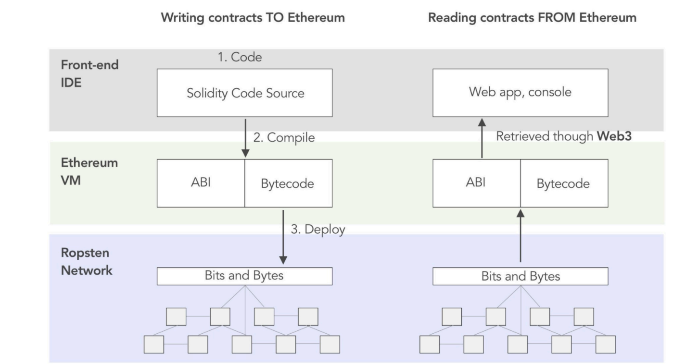
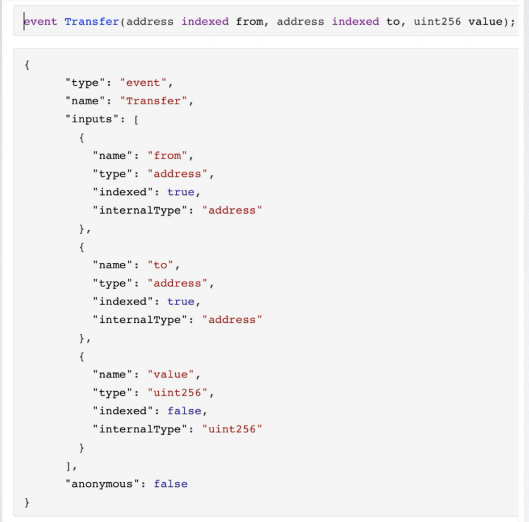
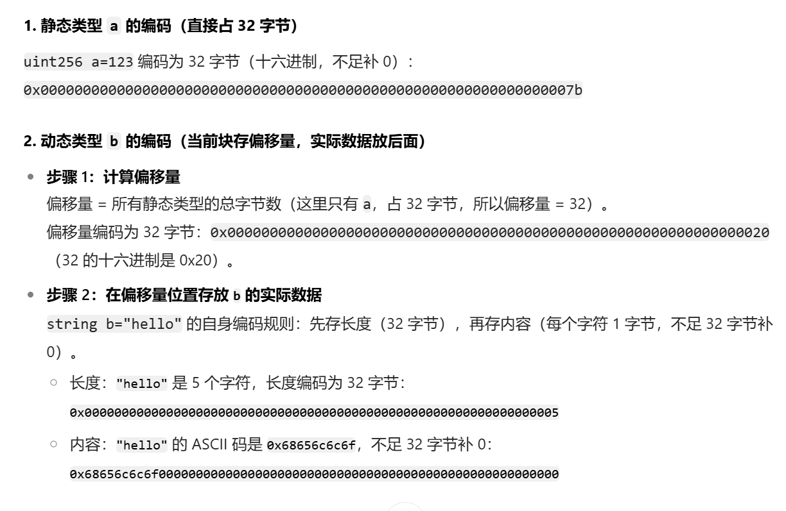

## 深入ABI

### 什么是ABI
- 智能合约应用二进制接口(Application Binary Interface,简称 ABI)是EVM中与合约交互的标准方式:包含接口描述和编码规范
- 标准:方便人类阅读、定义接口 使前后端,其他智能合约能够正确地与合约进行交互;

### 如何生成 ABI

* ABI 是编译的产物(solc),使用 Remix 和 Foundry
* forge build Counter.sol
    * 在 /out/Counter.sol/Counter.json 中包含ABI
* forge inspect : 检查和获取智能合约的元数据信息:ABI、字节码...
    * forge inspect Counter abi --json > Counter.json

### ABI 接口描述

* ABI 是一个json 对象数组, 每一个json 对象用来描述函数、事件、错误
* 每个json 对象包含:
    * type: function, event , error
    * name: 函数名称、事件名称..
    * inputs / outputs: 函数入参,是一个数组对象,每个数组对象会包含:
    * name: 参数名称;
    * type: 参数类型
    * indexed:事件索引字段(字段是 event topic ,则为 true)
    * components: 供元组(tuple) 类型使用(ABI 里只有预定义类型); 
* stateMutability: 为下列值之一: pure , view , nonpayable 和 payable 。

### ABI 编解码

- 函数 \ 错误:函数选择器 + 参数编码

-  函数选择器:函数签名的 Keccak 哈希的前 4 字节 (也叫函数 ID )

    * 函数签名: 由函数名和括号中的参数类型列表组成,参数类型列表之间用逗号分隔,不包含参数名称、空格,返回值类型和修饰符。

- 参数编码:第5个字节开始,静态(基本)类型扩展到 32 字节表示,动态类型用起始位置、数据大小、真实数据

### ABI 编码工具

- Foundry: cast abi-encode / cast decode-calldata
- Solidity: abi.decode / abi.encode
- viem / ethers.js /
- https://chaintool.tech/calldata
- https://openchain.xyz/
- ABI 数据库: https://www.4byte.directory/