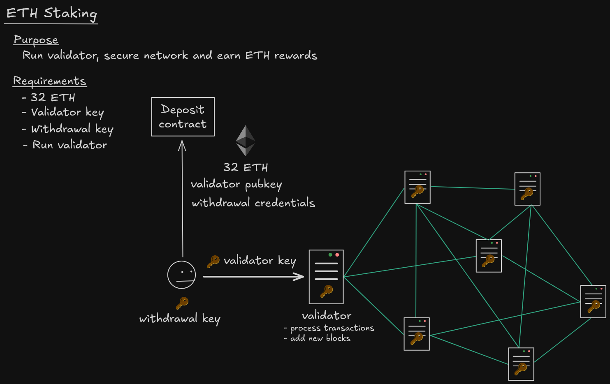
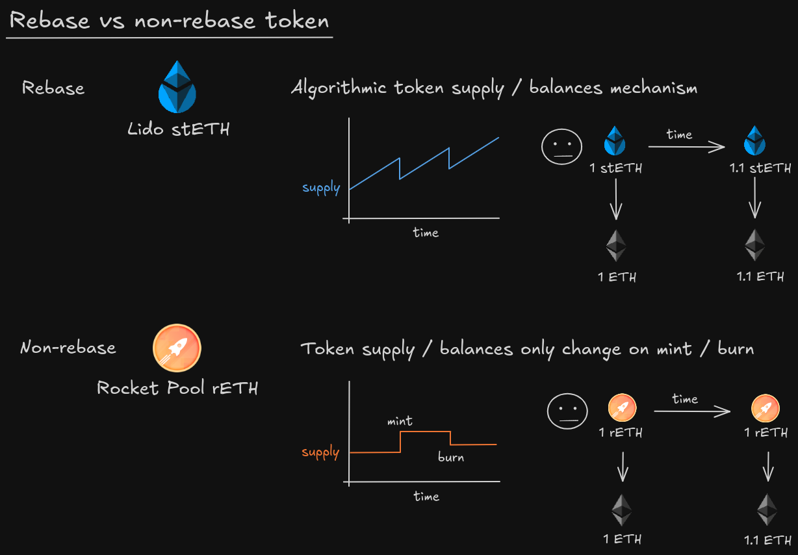

## ETH Staking 

### example:

let's say that Alice has 32 ETHs. With her 32 ETH, she wants to run a validator and secure the ETH network and earn some ETH rewards ETH. The first step is to stake her 32 ETH. She does this by sending a transaction to a deposit contract, sending her 32 ETH, and the validator public key which is derived from her validator key,and her withdrawal credentials which is derived from her withdrawal key. The withdrawal key is later used when she wants to unstake her 32 ETH. Next she will run a validator.The validator key is used by the validator to sign blocks and attest to transactions. So she'll need to take this validator key, and then stick it inside this server that runs the validator software.

## Rebase Token and non-Rebase Token

### example:

* rebase token: 余额随着价值变动
* non-rebase token：余额不会随着价值变动