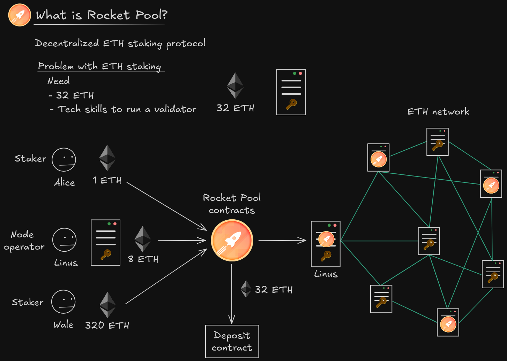

## Rocket Pool

### example:

The way it works is that all three of these users will interact with the RocketPool contracts.Alice will deposit 1 ETH, Linus will deposit 8 ETH, and also Alice register as a node operator. Now remember that to become a validator in the ETH network, you need a multiple of 32 ETH.And now Linus can register as a validator within the RocketPool protocol to become a validator.Now here, instead of running the ETH validator software, Linus will have to run a RocketPool software. This RocketPool software will interact with the ETH network to earn ETH staking rewards.、

## mint