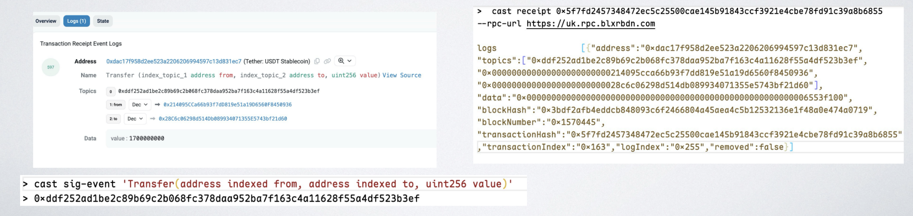

## 事件索引 - 数据采集

问题：
- 如何展示用户地址的完整的转账记录?

- 交易所如何知道用户充值 USDT / ETH 到账?


### 事件编解码

- 事件签名编码为 Topic0 (非匿名事件),值为: Keccak256(事件签名)

- 日志(log)条目中,还会包含 address, 表示哪个合约抛出的日志。

- Indexed 参数,作为 topic 存储, 最多有 4 个 topic

    * 索引的参数是数组和结构体时,topic 编码为 Keccak256 。

- 非 Indexed 参数采用和函数参数编码 一样的规则,非索引事件作为 data 保存



### 监听链上数据

- 自建后端(从RPC API 从节点读取数据)
- 订阅( subscription)
- 扫块(轮询 Poll / block scanning)
- 第三方数据服务商


### 订阅
在区块链数据获取场景中，subscription 是一种实时获取区块链新数据的被动式机制，核心是 <span style="color:red;">“节点主动推送，客户端被动接收”，</span>用于高效、实时地监控区块链上的事件或状态变化。


https://ethereum.org/en/developers/tutorials/using-websockets/#eth-subscribe

```js
viem 订阅
• client.watchBlocks / watchEvent / watchPendingTransactions
const publicClient = createPublicClient({
chain: foundry,
transport: webSocket(process.env.RPC_URL!),
})

publicClient.watchBlocks({
onBlock: async (block) => {
}
}
```
### 订阅的一些问题

- 可靠性问题: 可能会因为网络问题、节点问题等原因断开, 订阅断开,可能会错过一些事件

- 历史数据问题:只能获取到订阅开始后的新事件

- 性能开销:订阅(多的话)对节点压力大, 有些节点有限制\


### 扫块

- 扫块虽然看起来”笨重”,<span style="color:red;">但通常更可靠和更有效:</span>

- 不会遗漏数据、依赖特定的节点功能
 * 通过 RPC API 从节点读取数据
 * 区 块: eth_getBlockByHash 、 eth_getBlockByNumber
 * 交 易:eth_getTransactionByHash
 * 交易收据:eth_getTransactionReceipt
 * 交易日志:<span style="color:red;">eth_getLogs (Viem : getLogs )</span>

### getLogs

https://viem.sh/docs/actions/public/getLogs#arguments

* 获取所有事件
```js
import { publicClient } from './client'
const logs = await publicClient.getLogs()
```


* 获取区块高度内所有事件
```js
import { publicClient } from './client'

const logs = await publicClient.getLogs({
fromBlock: 16330000n,
toBlock: 16330050n
})
```


* 获取指定合约的事件
```js
import { parseAbiItem } from 'viem'

const logs = await publicClient.getLogs({
address: '0xa0b86991c6218b36c1d19d4a2e9eb0ce3606eb48',
fromBlock: 16330000n,
toBlock: 16330050n
})
```


* 获取指定合约、指定事件
```js
import { parseAbiItem } from 'viem'

const logs = await publicClient.getLogs({
address: '0xa0b86991c6218b36c1d19d4a2e9eb0ce3606eb48',
event: parseAbiItem('event Transfer(address indexed from, address indexed to, uint256 value)'),
fromBlock: 16330000n,
toBlock: 16330050n
})
```

* 获取指定合约、指定事件
```js
import { parseAbiItem } from 'viem'

const logs = await publicClient.getLogs({
address: '0xa0b86991c6218b36c1d19d4a2e9eb0ce3606eb48',
event: parseAbiItem('event Transfer(address indexed from, address indexed to, uint256 value)'),
args: {
from: '0xd8da6bf26964af9d7eed9e03e53415d37aa96045',
to: '0xa5cc3c03994db5b0d9a5eedd10cabab0813678ac'
},
fromBlock: 16330000n,
toBlock: 16330050n
})
```

* 获取指定合约、指定事件及指定参数[数组]
```js
import { parseAbiItem } from 'viem'

const logs = await publicClient.getLogs({
address: '0xa0b86991c6218b36c1d19d4a2e9eb0ce3606eb48',
event: parseAbiItem('event Transfer(address indexed from, address indexed to, uint256 value)'),
args: {
// '0xd8da...' OR '0xa5cc...' OR '0xa152...'
from: [
'0xd8da6bf26964af9d7eed9e03e53415d37aa96045',
'0xa5cc3c03994db5b0d9a5eedd10cabab0813678ac',
'0xa152f8bb749c55e9943a3a0a3111d18ee2b3f94e',
],
}
})
```


* 同时获取多个事件
```js
import { parseAbi } from 'viem'

const logs = await publicClient.getLogs({
events: parseAbi([
'event Approval(address indexed owner, address indexed sender, uint256 value)',
'event Transfer(address indexed from, address indexed to, uint256 value)',
]),
})
```

交易所如何知道用户充值 USDT / ETH 到账?

1. 为用户分配充值地址（如`0x456...`）；
2. 通过节点 API（如`eth_getLogs`）订阅 USDT 合约的Transfer事件，过滤条件为：to = `0x456...`（利用to的 indexed 属性，通过`topics`快速匹配）；
3. 当有转账触发`Transfe`r事件，且to为`0x456...`时，提取事件中的value（转账金额）；
4. 等待该交易被足够区块确认（如 6 个，与 ETH 一致）后，将金额计入用户账户，标记为 “充值到账”。


