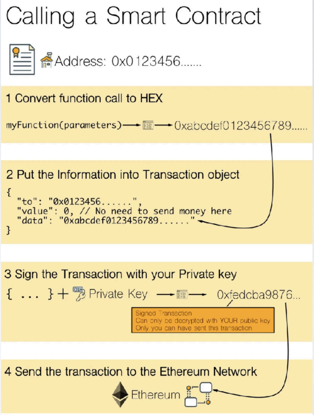
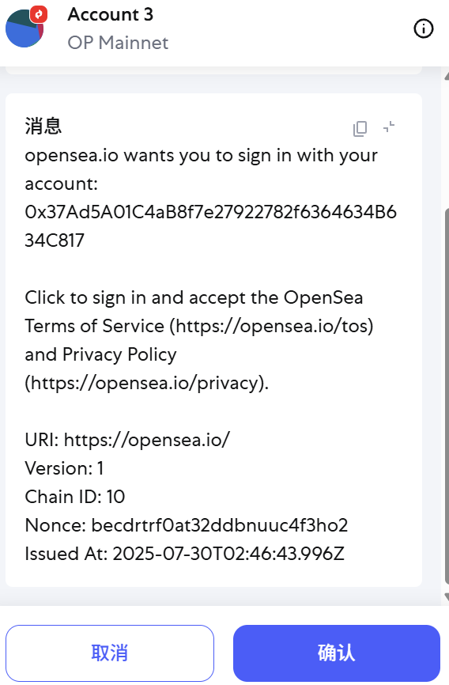
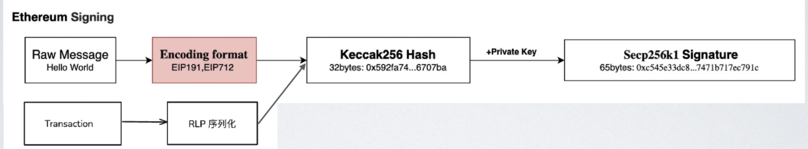
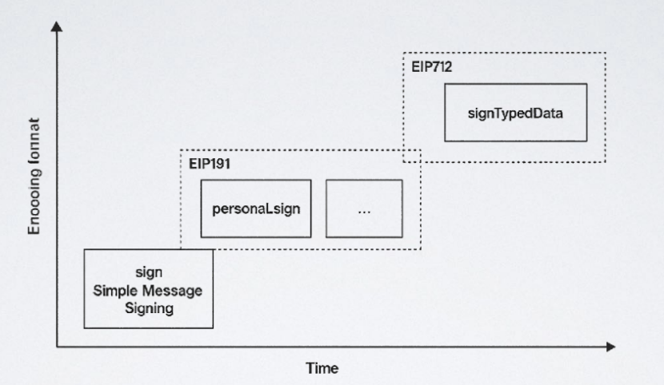

## 以太坊签名与应用

### 交易构造与签名

1. ABI编码
2. 构造交易
3. RLP序列化、Hash、签名
4. 广播上链
5. 签名在节点验证

注意：
RLP 序列化 → 哈希 → 签名：给交易 “盖防伪章”
- **RLP 序列化：**
    * 递归长度前缀编码（RLP）是以太坊内置的**数据序列化协议**，将交易对象的键值对按固定顺序转换为字节流（如 [nonce, gasPrice, gasLimit, to, value, data] 依次编码）。
    * 目的：统一数据格式，方便后续哈希和签名。
- **哈希：** 对 RLP 序列化后的字节流计算 keccak256 哈希，得到 **待签名哈希**（交易的唯一标识雏形）。
- **签名：**
    * 用私钥对 “待签名哈希” 加密，生成 r、s、v 三个签名参数：
    * r、s：椭圆曲线加密的两个核心参数；
    * v：恢复公钥的辅助值（还包含链 ID，防止跨链重放攻击，如 EIP-155 改进）。
**防伪逻辑**只有私钥持有者能生成有效签名，节点可通过 v 恢复公钥，推导出发送方地址，验证 “交易确实由该地址发起”。

### SIWE 以太坊登录（EIP4361）

- 用户通过签署一段**规范的消息**来证明对地址的控制权。

- 签名在后端验证,实现去中心化的登录认证。

1. **“规范消息” 是什么？（基于 EIP-4361 标准）**
SIWE 的消息必须遵循 EIP-4361 协议 格式，包含以下关键信息（防止钓鱼、重放攻击）：

* `domain（域名）：`比如 example.com，确保用户签名的是合法平台（防止伪造登录请求）；
* `nonce（随机数）：`每次登录生成不同值，防止攻击者重复使用旧签名登录；
* `timestamp（时间戳）：`限定签名有效期，防止旧签名被滥用；
* `uri（平台地址）：`明确登录的目标平台；
* `statement（声明）：`可选，平台可自定义提示（如 “你正在登录 XXX 应用”）。

2. **和 “交易签名” 的关联与区别**
* 相同点：都用私钥签名，依赖椭圆曲线加密验证身份，核心是 “只有私钥持有者能签名”。
* 不同点：
    * 交易签名：签名的是**链上交易**（会广播到区块链，花 Gas 费，改变账户状态）；
    * SIWE 签名：签名的是**离线消息**（不上链，不花 Gas 费，仅用于身份认证）。

### 签名步骤

- 编码格式:EIP191 / EIP712（详细请看EIP协议分析）

- Keccak256 哈希算法,是 SHA-3 族:安全性高,灵活,速度快

- 椭圆曲线加密算法 Secp256k1:高效性,安全性,标准化

### 签名标准 - 规范编码格式

- EIP191: 区分交易签名和其他信息签名

- EIP712: 定义结构化信息签名标准

